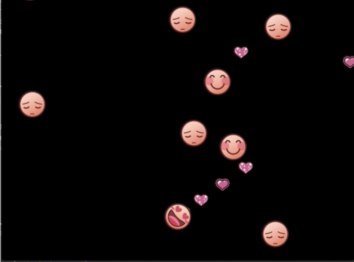

# more-hearts-than-bullets
a cute violence free space invader version where one cheers up friends by sending love

## inspiration 

working through "Learn Game Programming with Ruby" by Mark Sobkowicz 

one of the chapters focused on a space invader game and i noticed how unmotivated i was to programm a shooting game.

so i didn't!

## installing

for this to run you need ruby and gosu

info on how to install can be found on the [Ruby Gosu website](https://www.libgosu.org/ruby.html)

after installing you can run by ```ruby more_hearts.rb```

## playing


in this game you send love to yourt sad friends to make sad smiles happy! if they are happy they can even help you by cheering up all sad smiles they encounter. 



you move the squares with the arrow keys 

pressing 'r' will reload and 'esc' will close the window

have fun!

